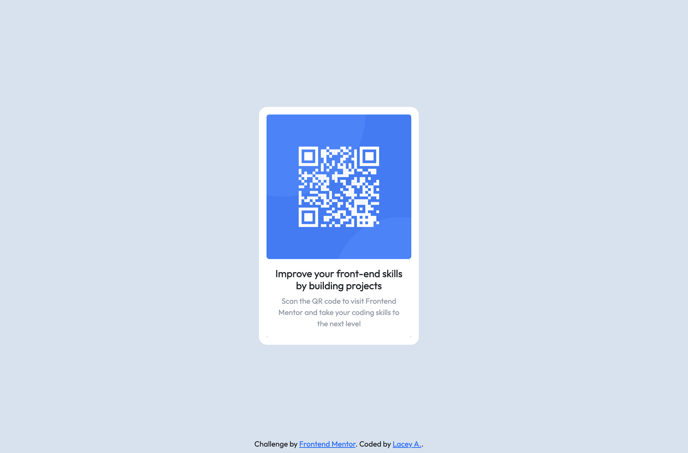

# Frontend Mentor - QR code component solution

This is a solution to the [QR code component challenge on Frontend Mentor](https://www.frontendmentor.io/challenges/qr-code-component-iux_sIO_H). Frontend Mentor challenges help you improve your coding skills by building realistic projects. 

## Table of contents

- [Overview](#overview)
  - [Screenshot](#screenshot)
  - [Links](#links)
- [My process](#my-process)
  - [Built with](#built-with)
  - [What I learned](#what-i-learned)
  - [Continued development](#continued-development)
  - [Useful resources](#useful-resources)
- [Author](#author)


## Overview

### Screenshot





### Links

- Solution URL:  https://github.com/laceyaguigam/QR-Code-Challenge
- Live Site URL: https://laceyaguigam.github.io/QR-Code-Challenge/

## My process

### Built with

- Semantic HTML5 markup
- CSS custom properties
- Bootstrap framework

### What I learned

This project has taught me how to import custom fonts into a project using two different methods. The first method is linking the font url in the head section and the second method is downloading the file(s), adding them into the project and then importing them into the project using css. 


```html
<style>
  @import url('https://fonts.googleapis.com/css2?family=Outfit&display=swap');
</style> 
```
```css
@fontface {
  font-family: 'Outfit', 'Sans-serif';
  src: url (Outfit-VariableFont_wght.ttf);
}
```


### Continued development

I plan to continue to develop my skills using bootstrap as a framework for future projects while also learning to use custom css properties to style the project. Another area I will be focusing on in future projects will be media queries and how to use them in a css styling sheet. 


### Useful resources

- Stackoverflow (https://stackoverflow.com/) - This helped me find the answers to the problems I was having with my code. I was able to search for various problems that I was having and found multiple suggestions on how to solve the problem, I found helpful solutions with explanations.
- Get Bootstrap (https://getbootstrap.com/docs/5.3/getting-started/introduction/) - This is the boostrap website, I am currently still learning how to use this framework. This site is helpful when you are learning how to create respoinsive pages.
- MDN (https://developer.mozilla.org/en-US/docs/Web/CSS) - This is a great resource when you need a reference sheet for anything code related. I refer to this site when I need a code refresher in any languge, I recommend this site to all developers.


## Author

- Website - Lacey Aguigam ( https://laceyaguigam.github.io/Professional-Portfolio/)
- GitHub - @laceyaguigam (https://github.com/laceyaguigam)
- Frontend Mentor - @laceyaguigam (https://www.frontendmentor.io/profile/laceyaguigam)


